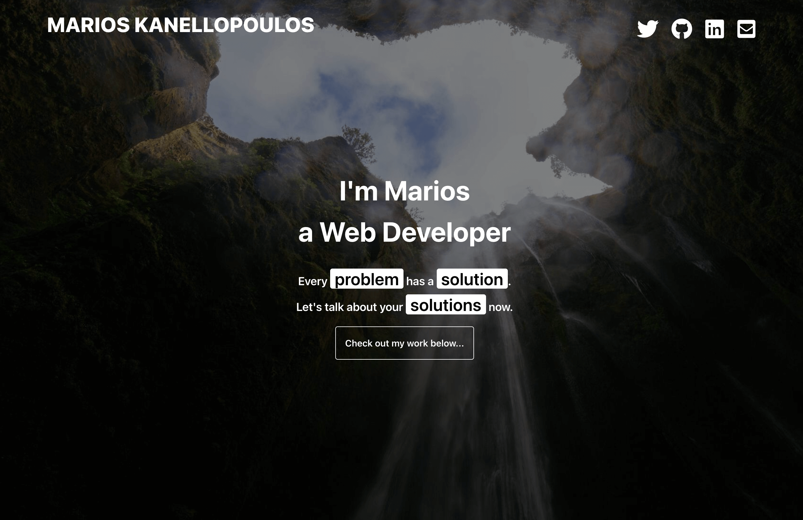
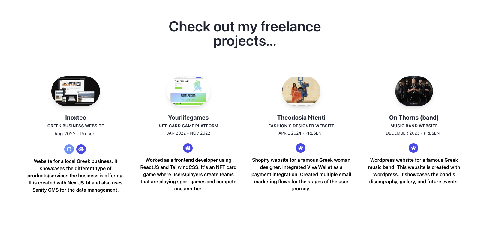
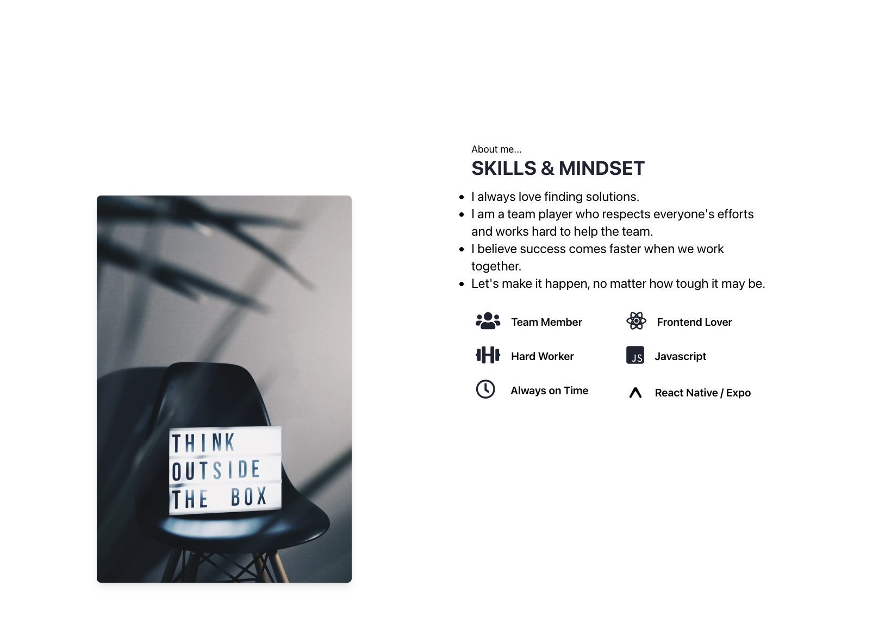
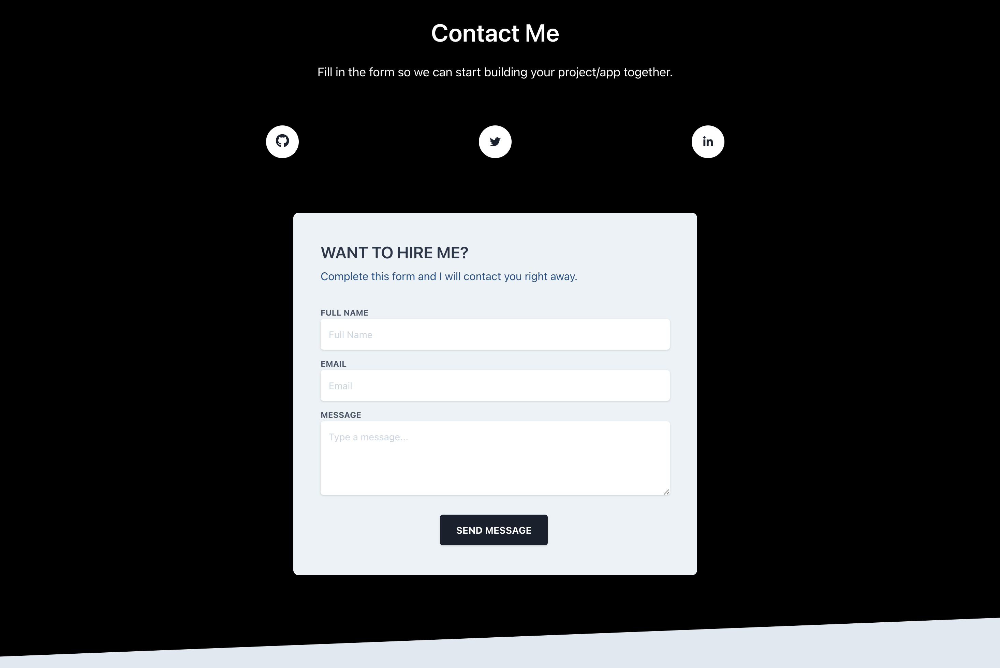

# Portfolio

This is my personal portfolio created with Tailwind CSS. We can find details about my skills as well as projects which I'm most proud of creating. There is a form with which you can get in contact with me. Lastly, I have added all my social accounts.

# BUILD WITH

- HTML
- Tailwind CSS

# Live Version

https://marioskanellopoulos.com/

# AUTHOR

- Github: [@mariosknl](https://github.com/mariosknl)
- Twitter: [@mariosknl](https://twitter.com/MariosKnl)
- Linkedln: [marios-kanellopoulos](https://www.linkedin.com/in/marios-kanellopoulos)
- Portfolio: [marios-kanellopoulos](https://marioskanellopoulos.com/)

# Show your support

Give ⭐️ if you like this project!

# Acknowledgments

- Microverse

### 🤝 Contributing

Contributions, issues, and feature requests are welcome!
Feel free to check the issues page.
